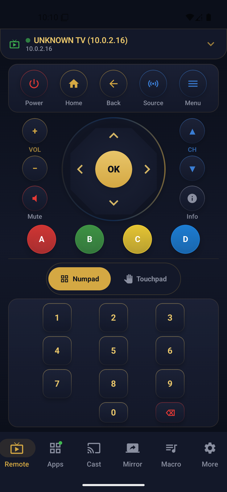
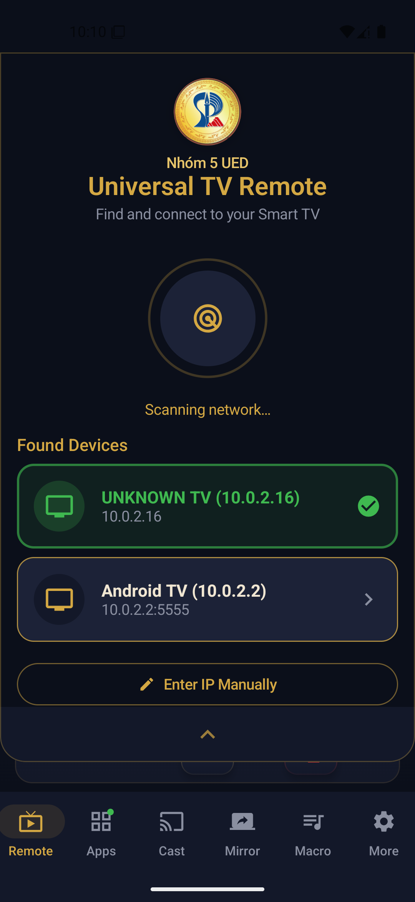
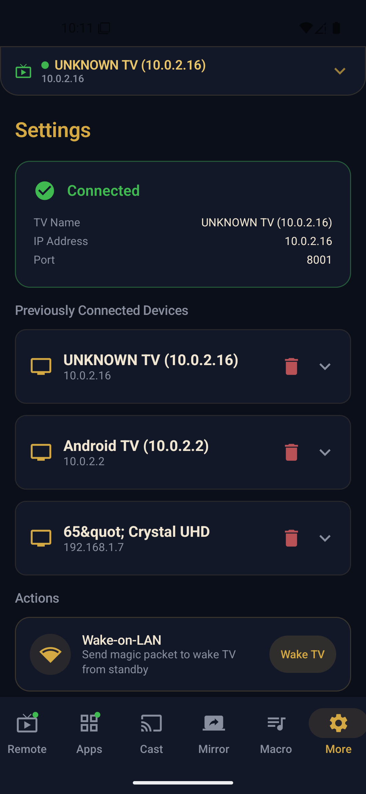

# 📱 Universal TV Remote

<p align="center">
  
  
  
  
  
  
</p>

<p align="center">
  <strong>Điều khiển mọi Smart TV chỉ với một ứng dụng duy nhất.</strong><br>
  Quét thiết bị tự động • Hỗ trợ đa nhãn • Giao diện Material Design 3
</p>

<p align="center">
  
</p>

---

## ✨ Tính năng nổi bật

| Tính năng | Mô tả |
|---|---|
| 🔍 **Quét thiết bị tự động** | Tự động phát hiện Smart TV trong mạng LAN qua SSDP/DIAL/mDNS |
| 🎮 **Điều khiển từ xa** | D-pad, touchpad, phím số, phím nhanh (Home, Back, Volume, Power...) |
| 📋 **Danh sách ứng dụng** | Xem và khởi chạy ứng dụng trên TV từ điện thoại |
| 🎬 **Cast & Mirror** | Chiếu video/hình ảnh từ điện thoại lên TV; phản chiếu màn hình |
| ⚡ **Macro** | Lưu và thực thi chuỗi thao tác phím một chạm |
| 🔧 **Cài đặt linh hoạt** | Quản lý nhiều TV, cấu hình kết nối tùy ý |

---

## 📺 Hỗ trợ các thương hiệu TV

<p align="center">
  
</p>

Ứng dụng hỗ trợ **07 nền tảng Smart TV phổ biến**:

| Thương hiệu | Giao thức | Cổng | Nhánh phát triển |
|---|---|---|---|
| **Samsung** | Samsung Remote Protocol | 8001 / 8002 | `feature/samsung-lg-androidtv-diem` |
| **LG** | WebOS API | 3000 / 3001 | `feature/samsung-lg-androidtv-diem` |
| **Android TV** | ADB / Google Cast / DIAL | 8008 – 9001 | `feature/samsung-lg-androidtv-diem` |
| **Sony Bravia** | BRAVIA API | 80 / 8008 | `feature/apps-macro-multibrand-kiet` |
| **Roku** | Roku ECP | 8060 | `feature/apps-macro-multibrand-kiet` |
| **Vidaa (Hisense)** | Vidaa Protocol | 36669 | `feature/apps-macro-multibrand-kiet` |
| **Vizio** | SmartCast API | 7345 / 9000 | `feature/apps-macro-multibrand-kiet` |

---

## 🛠️ Công nghệ sử dụng

| Lớp | Công nghệ |
|---|---|
| **Ngôn ngữ** | Kotlin 1.9+ |
| **UI Framework** | Jetpack Compose + Material Design 3 |
| **Architecture** | MVVM + Clean Architecture |
| **Async** | Kotlin Coroutines + Flow |
| **Networking** | OkHttp 4 |
| **Serialization** | Gson |
| **Storage** | DataStore Preferences |
| **Image Loading** | Coil |
| **Navigation** | Navigation Compose |
| **DI** | Hilt *(lộ trình mở rộng)* |
| **Build** | Gradle (Kotlin DSL) |

---

## 👥 Đội ngũ phát triển

<p align="center">
  
</p>

Dự án được phát triển bởi **Nhóm 5 – UED** với 5 thành viên, mỗi người phụ trách một nhánh tính năng riêng biệt.

| Thành viên | GitHub | Phạm vi | Nhánh |
|---|---|---|---|
| **Nguyễn Thu Hương** *(Nhóm trưởng)* | [@thuhuong16065](https://github.com/thuhuong16065) | Kiểm thử, sửa lỗi, tích hợp, video demo | `feature/device-scan-huong` |
| **Đỗ Thị Mỹ Duyên** | [@mduyen123](https://github.com/mduyen123) | Thiết kế UI, giao diện chính, UX | `feature/remote-ui-khoi` |
| **Hoàng Thị Kiều Diễm** | [@hoangkieudiem2709](https://github.com/hoangkieudiem2709) | Theo dõi tiến độ, tổng hợp báo cáo, kiểm thử | `feature/samsung-lg-androidtv-diem` |
| **Lê Thiện Khôi** | [@kkitb003](https://github.com/kkitb003) | Cast media, screen mirroring, settings | `feature/cast-mirror-duyen` |
| **Nguyễn Tuấn Kiệt** | [@kitcoding17032005](https://github.com/kitcoding17032005) | Quét thiết bị, kết nối TV, điều khiển cơ bản | `feature/apps-macro-multibrand-kiet` |

---

## 📂 Cấu trúc dự án

```
universaltvremote/
├── app/                           # Module ứng dụng chính
│   ├── src/main/
│   │   ├── java/com/ued/universaltvremote/
│   │   │   ├── MainActivity.kt    # Entry point
│   │   │   └── viewmodel/
│   │   │       └── MainViewModel.kt
│   │   └── res/                   # Tài nguyên (drawable, values, mipmap)
│   └── build.gradle.kts
├── docs/                          # Tài liệu nhóm
│   └── team-commit-plan/          # Kế hoạch & phân công
├── build.gradle.kts               # Root build config
├── settings.gradle.kts
└── README.md
```

---

## 🚀 Cách chạy ứng dụng

### Yêu cầu

- **Android Studio** Hedgehog (2023.1.1) trở lên
- **Android SDK** 36
- **Java** 11+
- **Gradle** 8.x (dùng wrapper có sẵn)

### Các bước

```bash
# 1. Clone repository
git clone https://github.com/your-org/universal-tv-remote.git
cd universal-tv-remote

# 2. Mở bằng Android Studio
# File → Open → Chọn thư mục project

# 3. Build (dùng Gradle wrapper)
./gradlew assembleDebug
# Hoặc trên Windows:
.\gradlew.bat assembleDebug

# 4. Cài đặt trên thiết bị / emulator
./gradlew installDebug
```

### Quy ước commit theo nhánh

```
📌 Mỗi thành viên làm việc trên nhánh riêng:
  feature/device-scan-huong          → Hương
  feature/remote-ui-khoi            → Khôi
  feature/cast-mirror-duyen         → Duyên
  feature/samsung-lg-androidtv-diem → Diễm
  feature/apps-macro-multibrand-kiet→ Kiệt

📌 Merge vào nhánh chính qua Pull Request + code review.
```

---

## 📸 Giao diện ứng dụng

> Thêm ảnh chụp màn hình vào thư mục `./screenshots/` để hiển thị tại đây.

| Ảnh | Mô tả |
|---|---|
| `screenshot-hero.png` | Ảnh hero/giao diện chính |
| `screenshot-devices.png` | Danh sách thiết bị đã kết nối |
| `screenshot-remote.png` | Màn hình điều khiển từ xa |
| `screenshot-cast.png` | Giao diện Cast & Mirror |
| `screenshot-settings.png` | Màn hình cài đặt |

*Các file ảnh có thể là PNG hoặc JPG, kích thước khuyến nghị: 1280×720px.*

---

## 🤝 Đóng góp

Dự án chào đón mọi đóng góp! Vui lòng:

1. **Fork** repo này
2. Tạo nhánh mới cho tính năng (`git checkout -b feature/TenTinhNang`)
3. Commit thay đổi (`git commit -m 'Add: mô tả tính năng'`)
4. Push lên nhánh của bạn (`git push origin feature/TenTinhNang`)
5. Mở **Pull Request** để review

---

## 📄 Giấy phép

Dự án này được phát triển cho **mục đích học tập** trong khuôn khổ chương trình đào tạo.

---

<p align="center">
  <strong>Made with ❤️ by Nhóm 5 – UED</strong><br>
  <em>Phát triển ứng dụng Android • Jetpack Compose • Material Design 3</em>
</p>
